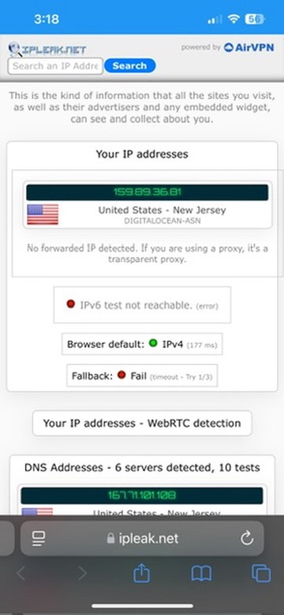
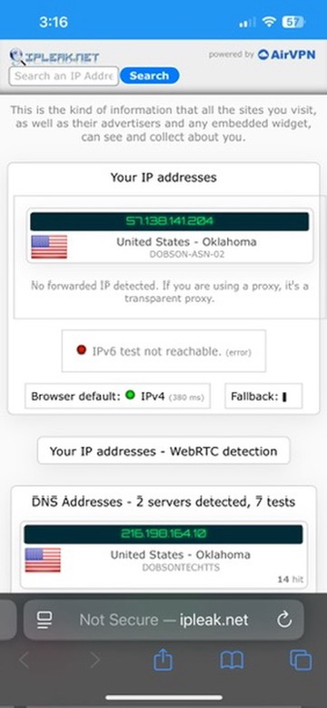
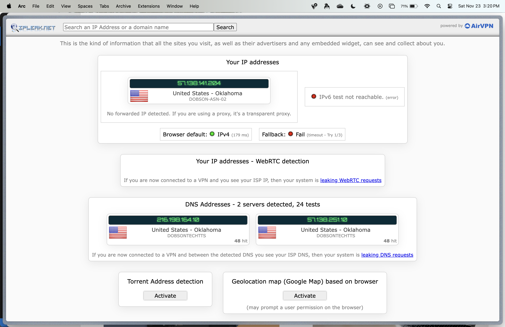
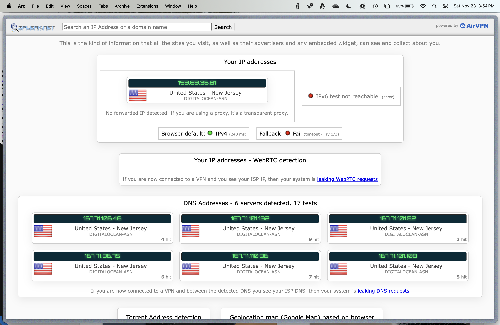
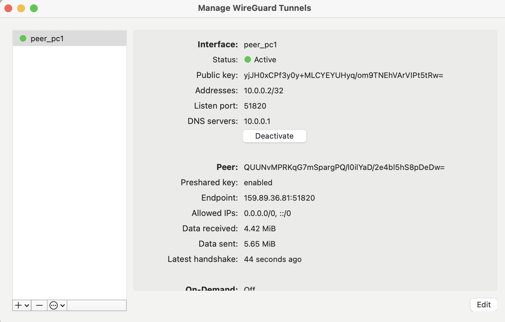

# Installing Wireguard VPN with Docker
### Digital Ocean
    - First and foremost, we must make a digital ocean droplet to run this on
### Install Docker
    - `sudo apt install apt-transport-https ca-certificates curl software-properties-common -y`
    - `curl -fsSL https://download.docker.com/linux/ubuntu/gpg | sudo apt-key add -`
    - `sudo add-apt-repository "deb [arch=amd64] https://download.docker.com/linux/ubuntu $(lsb_release -cs) stable"`
    - `apt-cache policy docker-ce`
    - `sudo apt install docker-ce -y`
    - `sudo curl -L "https://github.com/docker/compose/releases/download/1.27.4/docker-compose-$(uname -s)-$(uname -m)" -o /usr/local/bin/docker-compose`
    - `sudo chmod +x /usr/local/bin/docker-compose`

### Install Wireguard
    - `mkdir -p ~/wireguard/config/`
    - `nano ~/wireguard/docker-compose.yml`
        - Find this file online.

### Run Wireguard
    - `cd ~/wireguard/`
    - `docker-compose up -d`

### Set up Wireguard
    For phone:
        - `docker-compose logs -f wireguard`
        - Scan QR Code
    For computer:
        - Copy configuration files from the server using `scp`
        - `scp -r root@159.89.36.81:/root/wireguard/config/peer_pc1 ~/Desktop/`
        - Use the Wireguard PC app to enable the tunnel

## Pics or it didn't happen

